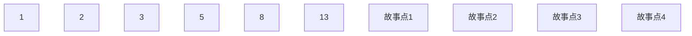

# 敏捷项目成本估算

用户故事点估算 目前做订阅管理模块的

## 用户故事列表

1. 作为一个用户 我想要新增订阅分组的功能 为了引入我的机场的节点 
2. 作为一个用户 我想要列出订阅分组的功能 为了了解我当前有多少个订阅分组
3. 作为一个用户 我想要更新订阅的功能 为了更新目前的节点
4. 作为一个用户 我想要编辑订阅分组信息和删除订阅的功能 为了更好地管理各组的节点

## 故事点映射到菲波拉契数列 图

目前还没有将各故事与故事点(工作量)联系起来

