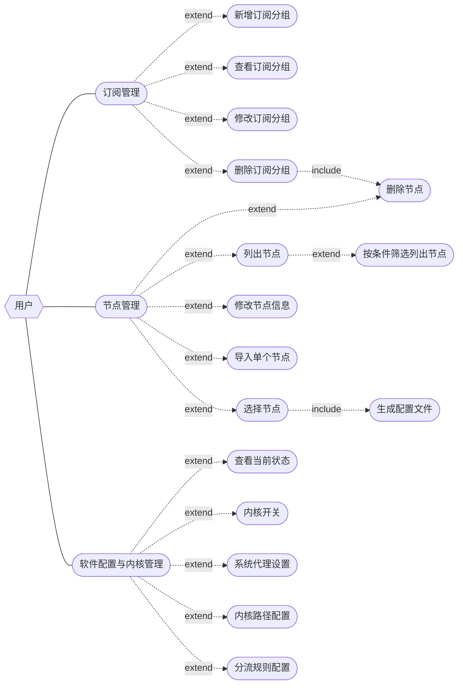

# 需求分析

1. 系统用例图
2. 系统流程活动图(4个)
3. 用例描述文档
4. 需求规格说明书

## 系统用例图

```mermaid
flowchart LR

id1{{用户}}
id2([订阅管理])
id3([节点管理])
id4([软件配置与内核管理])

id1 --- id2
id1 --- id3
id1 --- id4

id6([新增订阅分组])
id7([查看订阅分组])
id8([修改订阅分组])
id9([删除订阅分组])

id2 -.->|extend| id6
id2 -.->|extend| id7
id2 -.->|extend| id8
id2 -.->|extend| id9

id9 -.->|include| id15
%% 删除订阅的时候会把节点列表中该订阅分组的节点全部删除

id10([列出节点])
id11([按条件筛选列出节点])
id12([选择节点])
id13([生成配置文件])
id14([修改节点信息])
id15([删除节点])
id16([导入单个节点])

id3 -.->|extend| id15
id3 -.->|extend| id10
id10 -.->|extend| id11
id12 -.->|include| id13
id3 -.->|extend| id14
id3 -.->|extend| id16
id3 -.->|extend| id12

id17([查看当前状态])
id18([内核开关])
id19([系统代理设置])
id20([内核路径配置])
id21([分流规则配置])
%% 内核的选择是由当前选择的节点和分流设置决定的

id4 -.->|extend| id17
id4 -.->|extend| id18
id4 -.->|extend| id19
id4 -.->|extend| id20
id4 -.->|extend| id21
```

## 系统流程活动图

大概是由业务活动图转换而来 需要画4个
