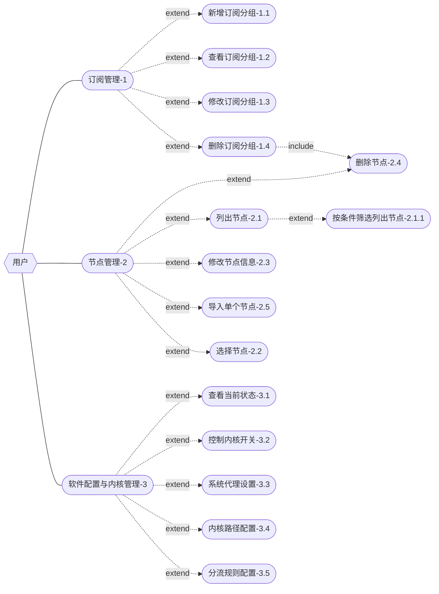

# 系统用例图

# 用例描述文档

将用例图中每个用例进行编号 按格式写出每个用例的具体细节

## 用例细节格式

**用例名称:**

**用例编号:**

**用例描述:**

**前置条件:**

**后置条件:**

**基本路径:**

**扩展路径(备选流程):**

## 用例列表

### 订阅管理

**用例名称:** 订阅管理

**用例编号:** 

**用例描述:**

**前置条件:**

**后置条件:**

**基本路径:**

**扩展路径(备选流程):**

