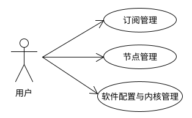
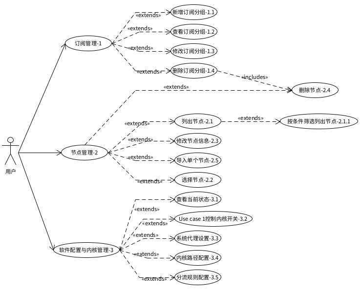

### 1.1 **系统架构分析**
本系统的架构基于客户端与代理服务的管理，支持多协议、多核心的代理操作。提供了对订阅、节点、客户端配置的全方位管理，前端可以启动代理服务、配置和数据监控。通过该架构，用户可高效地管理代理节点，实现灵活配置和便捷使用。

### 1.2 **可行性分析**
本系统实现了跨平台支持，且能满足多用户、多节点管理的需求。

#### 1.2.1 **经济可行性分析**
本系统的开发费用较低，主要依赖于软件开发和少量硬件需求。服务器的硬件要求不高，能在低成本的设备上运行，因此经济上是可行的。

#### 1.2.2 **技术可行性分析**
本系统使用了现代化的技术栈，支持多协议的代理处理和用户界面友好的管理后台，技术上可行，且利用现有的成熟框架和开源工具，降低了开发难度。

#### 1.2.3 **操作可行性分析**
用户端面向技术熟练的用户，能够快速上手。系统操作简便，适合广泛推广。

### 1.3 **系统业务功能需求分析**

#### 1.3.1 **总体功能性需求分析**
本系统负责订阅管理、节点管理、客户端配置与代理控制功能。主要功能包括：订阅分组管理、节点管理与测试、代理协议支持等。  
本系统的总体功能用例图如图2所示。

#### 1.3.2 **普通用户需求分析**
普通用户主要需要对代理节点进行选择、配置和控制。具体功能包括：
1. **订阅管理**：用户可以导入订阅链接、编辑和更新节点信息。
2. **节点管理**：用户可以选择、测试、配置节点，使用适合的节点进行代理操作。

本系统用户功能用例图如图3所示。

**图3 用户功能用例图**

