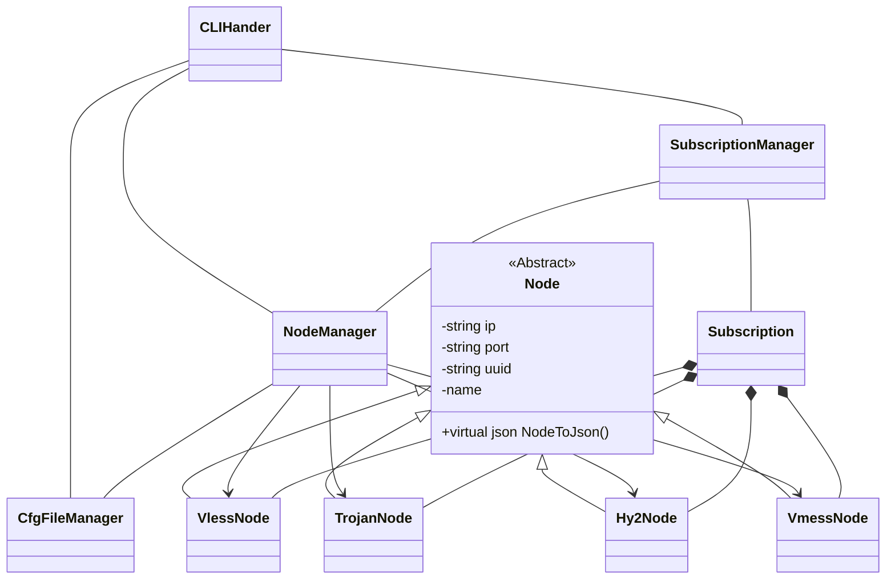
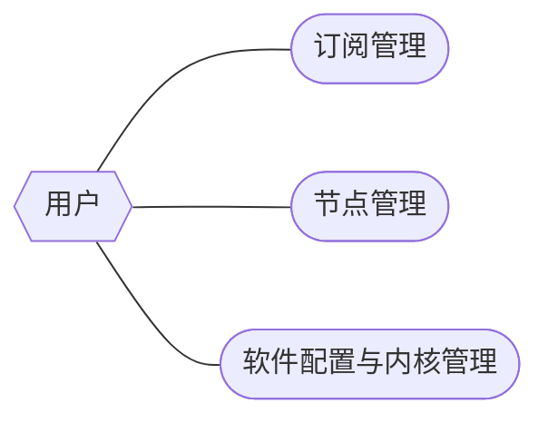
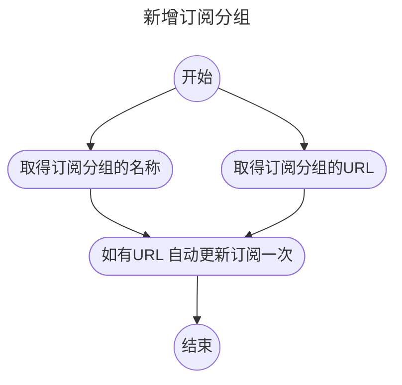
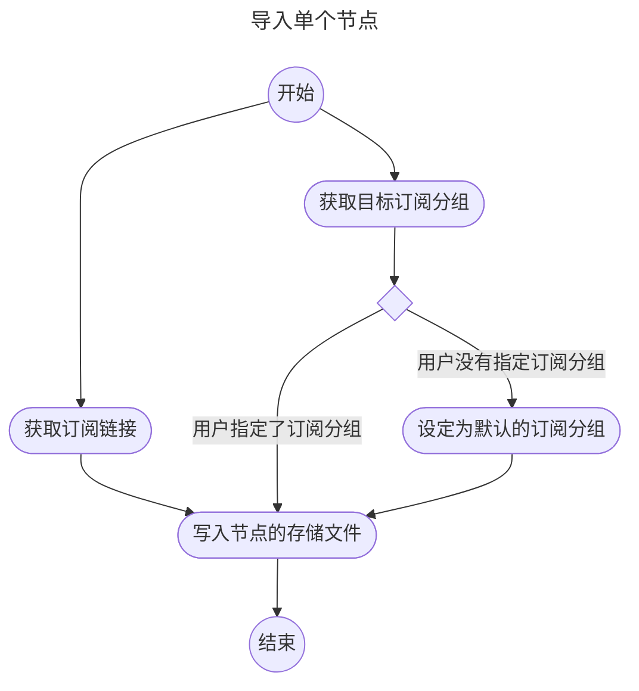
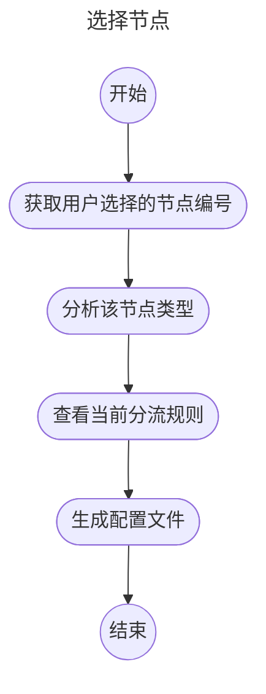

# 领域分析

1. 访谈记录与访谈分析
2. 领域类图
3. 业务用例图
4. 业务活动图

## 访谈记录与访谈分析

其实是本喵自己的需求(自己采访自己)

### 总体篇

**Q:** 平时翻墙有什么需求

**A:** 从机场订阅节点(或自己搭建节点) 选择一个节点 将节点信息写入配置文件 运行代理客户端内核 设置系统代理 开始翻墙

---

### 订阅管理

**Q:** 机场的节点信息是什么形式的? 需要怎么操作

**A:** 机场会提供一个**订阅链接** 其中的内容是一个**Base64的字符串** 将其解码后得到若干行**url格式的节点信息** 一行是一个节点

**Q:** 想要什么样的订阅管理功能

**A:** 首先需要**订阅分组** 一个订阅分组可以有一个名字和一个URL**订阅链接**(由机场提供) 然后有导入订阅功能 最后我们可以对各分组进行更新订阅 删除订阅 编辑订阅信息等操作 

### 节点管理

**Q:** 想要什么节点管理功能

**A:** 需要一个列出节点列表的功能 选中节点生成配置文件的功能(根据选中的节点进行内核的配置) 测试节点连通性和延迟的功能

**Q:** 对于单个的节点管理 你有什么想法吗

**A:** 目前我们只讨论了从机场的订阅链接获取节点信息的功能 对于自建的线路 我们是不是可以增加一个手动导入单个节点的功能 同样 也要删除单个节点的功能 不论那个节点是不是在订阅分组中 当然 手动导入的节点可以放在一个单独的分组中 这样可以自动管理 但是没有URL可供更新订阅就是了

**Q:** 附加的功能?

**A:** 有时候订阅数个机场 或节点数量过多 平时用不上这么多节点 但是又不想从订阅中删除节点 想弄出一个显示节点的筛选规则 这样只会看到我们想看的节点了

---

### 客户端与协议

**Q:** 平时使用哪些core客户端和协议

**A:** 我通常使用xray-core和Hysteria2 因为我用的机场提供trojan vmess vless hy2节点 其中前三种可以用xray解决 而hy2需要用一个特殊的客户端 xray的配置文件是json的 而hy2的配置文件是yaml的

**Q:** 客户端的代理分流情况大概怎样

**A:** xray自带分流 可以根据域名和ip来确定哪些网站走代理 哪些走直连 而hy2没有分流功能 所有的流量都会走代理 所以使用hy2的节点时 可以用xray的outbounds(出站规则)连接到hy2的监听端口 这样可以借助xray实现hy2的分流功能 (可能会有点耗电 因为两个内核都需要运行)

---

### 代理控制与软件本身

**Q:** 对于系统代理 你想要的最核心的功能是什么

**A:** 控制系统代理的开关 控制内核的运行状态

**Q:** 对于这个软件 还有什么想要的额外功能吗

**A:** 查看当前的状态 包括但不限于: 当前选中的节点 延迟值 内核状态  还有 配置核心的位置 可以在home中放一个.heresyrc作为heresy的配置文件 这个软件可以在发行时自带一些core(不过也可以自己配置...) 像V2RayN with core一样

**Q:** 你希望这个软件是命令行还是有图形界面

**A:** 反正常用的是命令行 但是也需要做图形界面给那些不习惯命令行的人使用 可以把后端和前端分离 做好那些功能 再做前端 前端可以是CUI 也可以是GUI

---

### 访谈分析

#### 一、用户需求概述
用户的主要需求是简化翻墙过程，特别是在管理机场节点和订阅的功能方面。用户希望能够方便地选择节点并将其写入配置文件，以便快速启动代理客户端。

#### 二、订阅管理
1. **订阅链接和节点信息**：
   - 用户明确了机场提供的**订阅链接**的作用，能够获取到Base64编码的节点信息，解码后形成以URL格式呈现的节点列表。

2. **功能需求**：
   - 用户希望有**订阅分组**的功能，能够对分组进行管理，包括导入、更新、删除和编辑操作。这表明用户希望能够灵活管理多个订阅源，而不只是单一的节点信息。

#### 三、节点管理
1. **功能需求**：
   - 用户提到需要展示节点列表的功能，并能够根据选中的节点生成内核配置文件。此外，测试节点的连通性和延迟也是用户关心的功能。

2. **自建线路的管理**：
   - 用户希望有手动导入单个节点的能力，以便管理自建的线路。这种灵活性能够帮助用户适应不同的使用场景。

3. **节点筛选**：
   - 对于节点数量较多的情况，用户希望能够有筛选规则，方便查看需要的节点而不必删除不常用的节点。这可以提升用户体验。

#### 四、客户端与协议
1. **使用情况**：
   - 用户常用的客户端包括xray-core和Hysteria2，表明需要支持不同的协议和内核。

2. **分流需求**：
   - 用户对xray的分流功能表示认可，但对于Hysteria2的流量处理方式提出了担忧。希望能通过xray实现对Hysteria2流量的分流控制。

#### 五、代理控制与软件本身
1. **核心功能**：
   - 用户认为控制系统代理的开关和内核的运行状态是最核心的功能。这是软件的基础要求。

2. **附加功能**：
   - 查看当前状态，包括选中节点、延迟和内核状态等信息，也是用户所需的附加功能。用户希望有一个配置文件（如`.heresyrc`），以便更好地管理软件的设置。

3. **界面选择**：
   - 虽然用户习惯命令行操作，但希望也有图形界面的支持，表明软件应具备灵活的用户界面选择。

#### 六、总结
总体来看，用户需求集中在提高翻墙的便捷性和灵活性，特别是在订阅和节点管理方面。软件的功能设计应优先考虑用户的基本需求，并提供友好的界面和灵活的配置选项，以满足不同用户的使用习惯和场景。

---

## 领域类图

## 业务用例图

## 业务活动图

这个不需要画很多个 老师说画三个就可以了

本喵这里就画新增订阅分组 手动导入单个节点和选择节点

